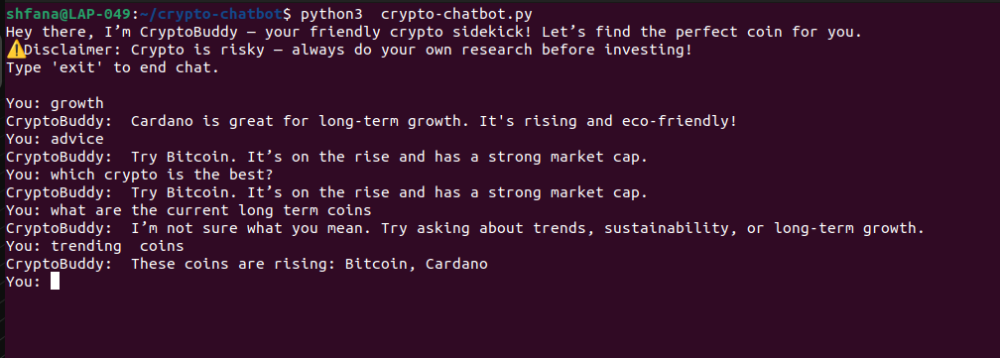

## Summary
CryptoBuddy is a simple rule-based AI chatbot that mimics decision-making by analyzing static crypto data and applying logic to respond. It shows how basic AI can match user input to specific data trends to give helpful, automated financial suggestions — great for beginners to understand AI-driven tools.

## Screenshot 

